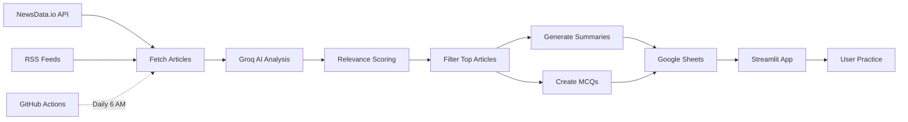

# 📰 Current Affairs Feed - UPSC/SSC Exam Preparation

> Your AI-powered daily current affairs companion for competitive exam preparation

[](https://current-affairs-app-hfsatasxmhlxkcxwmjgzuk.streamlit.app/)
[](https://www.python.org/)
[](LICENSE)

---

## 🚀 Quick Start

**Try the live app:** [current-affairs-app.streamlit.app](https://current-affairs-app-hfsatasxmhlxkcxwmjgzuk.streamlit.app/)

No installation needed! Just click and start practicing.

---

## ✨ Features

### 🤖 **AI-Powered Processing**
- **Dual AI System:**
  - **Groq Llama-3.1** (Bulk Processing) - Lightning-fast article analysis
  - **Google Gemini** (Premium Chat) - Intelligent Q&A responses
- **Smart Relevance Scoring** - AI rates each article 1-10 for exam relevance
- **Automatic Filtering** - Only shows high-quality, exam-focused content

### 📚 **Interactive Learning**
- **Interactive MCQs** - Click-to-answer with instant feedback
- **Retry & New Question** - Practice multiple questions per article
- **Exam-Focused Summaries** - 3-4 line summaries highlighting key facts
- **Subject Tags** - Identifies syllabus areas (Polity, Economy, etc.)

### 📅 **Advanced Filtering**
- **Date Range Selection** - View articles from any date range
- **Quick Filters** - One-click access to Today, Yesterday, Last 7/30 days
- **Date Statistics** - Article count breakdown by date
- **Multi-Source Support** - Filter by The Hindu, PIB, Times of India, etc.

### ⚡ **Automation**
- **Daily Auto-Fetch** - GitHub Actions fetches news every day at 6 AM IST
- **Auto-Processing** - AI analyzes and generates MCQs automatically
- **Auto-Save to Google Sheets** - No manual work required
- **Zero Maintenance** - Wake up to fresh content daily

### 💬 **AI Chat Assistant**
- Ask questions about current affairs
- Get exam-focused explanations
- Context-aware responses based on today's news

---

## 🎯 Who Is This For?

- **UPSC Aspirants** - Civil Services preparation
- **SSC Candidates** - Staff Selection Commission exams
- **Banking Exams** - Current affairs for IBPS, SBI, RBI
- **State PSC** - Regional competitive exams
- **General Knowledge** - Stay updated with relevant news

---

## 🛠️ Tech Stack

| Component | Technology | Purpose |
|-----------|-----------|---------|
| **Frontend** | Streamlit | Interactive web interface |
| **Bulk AI** | Groq (Llama-3.1) | Fast article processing (unlimited free) |
| **Premium AI** | Google Gemini | High-quality chat responses |
| **News API** | NewsData.io | Multi-source news aggregation |
| **Backup RSS** | The Hindu, PIB | Fallback news sources |
| **Database** | Google Sheets | Cloud storage |
| **Automation** | GitHub Actions | Daily scheduled tasks |
| **Deployment** | Streamlit Cloud | Free hosting |

---

## 📸 Screenshots

### Main Feed with Date Filtering
```
🔍 Filter Articles
[📅 Today] [📆 Yesterday] [📊 Last 7 Days] [📈 Last 30 Days]

📅 From Date: [Select]    📅 To Date: [Select]

Filter by source: [The Hindu ✓] [PIB ✓] [Times of India ✓]

📄 Articles: 15    ⭐ Avg Score: 8.2/10    📅 Days: 3
```

### Interactive MCQ Practice
```
❓ Question: Which international organization recently announced...?

[A) United Nations       ]  [B) World Bank          ]
[C) International Monetary Fund]  [D) World Trade Organization]

✅ Correct! Well done!
💡 Explanation: The IMF announced new economic forecasts...

[🔄 Retry This Question]  [🎲 Generate New Question]
```

---

## 🚀 Getting Started

### For Users (No Setup Required)

1. **Visit the app:** [current-affairs-app.streamlit.app](https://current-affairs-app-hfsatasxmhlxkcxwmjgzuk.streamlit.app/)
2. **Browse articles** - Filtered and ready to study
3. **Practice MCQs** - Interactive questions with instant feedback
4. **Use date filters** - Revise any past date
5. **Ask questions** - Get AI-powered explanations

### For Developers (Self-Hosting)

#### Prerequisites
- Python 3.11+
- Groq API Key (free at [console.groq.com](https://console.groq.com))
- Google Gemini API Key (free at [aistudio.google.com](https://aistudio.google.com/apikey))
- NewsData.io API Key (optional, free at [newsdata.io](https://newsdata.io))
- Google Sheets with public access

#### Installation

1. **Clone the repository**
```bash
git clone https://github.com/Prateekray/current-affairs-app.git
cd current-affairs-app
```

2. **Install dependencies**
```bash
pip install -r requirements.txt
```

3. **Set up secrets**

Create `.streamlit/secrets.toml`:
```toml
GROQ_API_KEY = "your-groq-api-key"
GEMINI_API_KEY = "your-gemini-api-key"
NEWSDATA_API_KEY = "your-newsdata-api-key"
SHEET_ID = "your-google-sheet-id"
```

4. **Run the app**
```bash
streamlit run streamlit_app.py
```

5. **Open browser**
```
http://localhost:8501
```

---

## 🤖 Automation Setup (Optional)

The app automatically fetches news daily at 6 AM IST using GitHub Actions.

### Enable Automation

1. **Set up Google Sheets API:**
   - Create a service account at [console.cloud.google.com](https://console.cloud.google.com)
   - Download JSON credentials
   - Share your Google Sheet with the service account email

2. **Add GitHub Secrets:**
   - Go to your repo → Settings → Secrets and variables → Actions
   - Add these secrets:
     - `GROQ_API_KEY`
     - `GEMINI_API_KEY`
     - `NEWSDATA_API_KEY`
     - `SHEET_ID`
     - `GOOGLE_CREDENTIALS_JSON` (entire JSON file content)

3. **The workflow runs automatically!**
   - Every day at 6:00 AM IST
   - Fetches news from multiple sources
   - Processes with AI
   - Saves to Google Sheets
   - No manual intervention needed

### Manual Trigger

You can also manually trigger the workflow:
1. Go to Actions tab
2. Click "Daily News Fetch"
3. Click "Run workflow"

---

## 📊 How It Works



**Daily Workflow:**
1. **6:00 AM IST** - GitHub Actions triggers
2. **Fetch** - Get latest news from NewsData.io + RSS feeds
3. **Analyze** - Groq AI scores each article (1-10 relevance)
4. **Filter** - Keep only relevant articles (score ≥ 4)
5. **Process** - Generate summaries and MCQs
6. **Save** - Auto-save to Google Sheets
7. **Done** - Fresh content ready in ~2 minutes!

---

## 🎨 Features Breakdown

### 1️⃣ Smart Article Processing
- Analyzes 10+ articles from multiple sources
- AI relevance scoring (1-10 scale)
- Automatic filtering of low-quality content
- Processing time: ~2-3 seconds per article

### 2️⃣ Interactive MCQ System
- JSON-based question format
- Four-option multiple choice
- Instant correct/wrong feedback
- Detailed explanations
- Retry same question or generate new ones

### 3️⃣ Date-Based Organization
- **Quick Filters:**
  - Today's news
  - Yesterday's recap
  - Last week's summary
  - Last month's overview
- **Custom Range:** Pick any start and end date
- **Statistics:** Article count per date
- **Grouping:** Articles organized by date headers

### 4️⃣ Premium Chat Interface
- Powered by Google Gemini (latest model)
- Context-aware responses
- Exam-focused explanations
- Answers based on loaded articles

---

## 📈 Performance

- **Processing Speed:** ~2-3 seconds per article (Groq)
- **Daily Capacity:** Unlimited (Groq has no practical limits)
- **Uptime:** 99.9% (GitHub Actions + Streamlit Cloud)
- **Cost:** $0 (All free tiers)

---

## 🔒 Privacy & Security

- **No user data collection**
- **API keys stored securely** in GitHub Secrets
- **Google Sheets access** via service account only
- **Public read-only** sheet access for users

---

## 🛣️ Roadmap

- [x] Basic news fetching
- [x] AI-powered summaries
- [x] Interactive MCQs
- [x] Date filtering
- [x] Automated daily updates
- [ ] Visual timeline/calendar view
- [ ] PDF export functionality
- [ ] User authentication
- [ ] Bookmark articles
- [ ] Study streak tracking
- [ ] Mobile app version

---

## 🤝 Contributing

Contributions are welcome! Here's how you can help:

1. **Fork the repository**
2. **Create a feature branch** (`git checkout -b feature/AmazingFeature`)
3. **Commit changes** (`git commit -m 'Add some AmazingFeature'`)
4. **Push to branch** (`git push origin feature/AmazingFeature`)
5. **Open a Pull Request**

---

## 📝 License

This project is licensed under the MIT License - see the [LICENSE](LICENSE) file for details.

---

## 🙏 Acknowledgments

- **Groq** - For providing free, blazing-fast AI inference
- **Google Gemini** - For powerful language model capabilities
- **NewsData.io** - For comprehensive news API
- **Streamlit** - For the amazing app framework
- **The Hindu & PIB** - For RSS feeds

---

## 📞 Contact & Support

- **Live App:** [current-affairs-app.streamlit.app](https://current-affairs-app-hfsatasxmhlxkcxwmjgzuk.streamlit.app/)
- **GitHub:** [@Prateekray](https://github.com/Prateekray)
- **Repository:** [current-affairs-app](https://github.com/Prateekray/current-affairs-app)

---

## ⭐ Star This Repository

If you find this helpful for your exam preparation, please ⭐ star this repo!

---

## 📚 Additional Resources

### For UPSC Aspirants:
- [UPSC Official Website](https://upsc.gov.in)
- [NCERT Books](https://ncert.nic.in)
- [PIB Daily Updates](https://pib.gov.in)

### For SSC Candidates:
- [SSC Official Website](https://ssc.nic.in)
- [SSC Exam Calendar](https://ssc.nic.in/examination-calendar)

---

<div align="center">

**Built with ❤️ for UPSC/SSC Aspirants**

[🚀 Try Live App](https://current-affairs-app-hfsatasxmhlxkcxwmjgzuk.streamlit.app/) • [⭐ Star on GitHub](https://github.com/Prateekray/current-affairs-app) • [📖 Documentation](https://github.com/Prateekray/current-affairs-app/wiki)

</div>